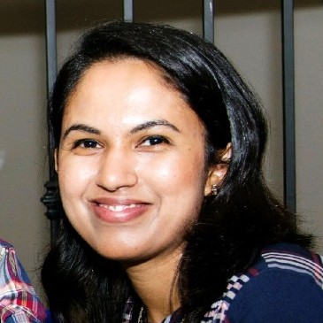

## _**ABOUT ME**_
   
<table style="border:none;">     
    <tr>         
        <td style="border:none; padding:0 15px 0 15px;"></td>         
        <td style="border:none; padding:0 15px 0 15px;">

            An experienced Software Engineer, a highly motivated graduate student, with a robust academic foundation in Object- Oriented programming, Software Engineering, Database
                        Systems and Front-End Development.  Possesses a strong aptitude for learning and mastering
                        new technologies.  Excellent leadership skills, interpersonal skills and teamwork capabilities.
            
</td>     
    </tr> 
</table>

 

  
 

## _**WORK EXPERIENCE**_

<table style="border:none; table-layout:fixed;">     
    <tr>         
        <td style="border:none; padding:0 15px 0 15px;" width="50%"></td>         
        <td style="border:none; padding:0 15px 0 15px;" width="50%"></td>
    </tr>
    <tr>         
            <td style="border:none; padding:0 15px 0 15px;">
               <b>Software Engineer  Goldman Sachs (October 2020 - Current)</b>   Working as a software Engineer to develop internal systems related to cotroling the trades.
            </td>         
            <td style="border:none; padding:0 15px 0 15px;">
               <b>Associate Software Engineer/ Software Development Intern  Virgin Pulse (April 2019 - October 2020)</b>   Developed RESTful Microservices to support a new feature introduced to the
platform (Corporate Wellness application) using Spring Boot, Spring Data and
other technologies.
            </td>     
        </tr>  
</table>

 

 

## _**EDUCATION**_

<table style="border:none; table-layout:fixed;">     
    <tr>         
            <td style="border:none; padding:0 15px 0 15px;">
               <b>UNIVERSITY OF TEXAS, ARLINGTON  MSc. Computer Science and Engineering </b> (2018 - Current)   Current Master student of the school
            </td>         
            <td style="border:none; padding:0 15px 0 15px;">
               <b>UNIVERSITY OF PERADENIYA, SRI LANKA  Bachelor of Medicine, Bachelor of Surgery (MBBS)</b> (2008 -2014)   Medical degree in Sri Lanka
            </td>     
        </tr>  
</table>

 

 

## _**PROJECTS**_

<table style="border:none; table-layout:fixed;">     
    <tr>         
            <td style="border:none; padding:0 15px 0 15px;">
               <b>UNIVERSITY OF TEXAS, ARLINGTON  MSc. Computer Science and Engineering </b> (2018 - Current)   Current Master student of the school
            </td>         
            <td style="border:none; padding:0 15px 0 15px;">
               <b>UNIVERSITY OF PERADENIYA, SRI LANKA  Bachelor of Medicine, Bachelor of Surgery (MBBS)</b> (2008 -2014)   Medical degree in Sri Lanka
            </td>     
        </tr>  
</table>

 

 

### _**CONTACT ME**_

<table style="border:none; table-layout:fixed;">     
    <tr>         
            <td style="border:none; padding:0 15px 0 15px;"></td>         
            <td style="border:none; padding:0 15px 0 15px;"></td>    
    </tr>  
</table>
  
